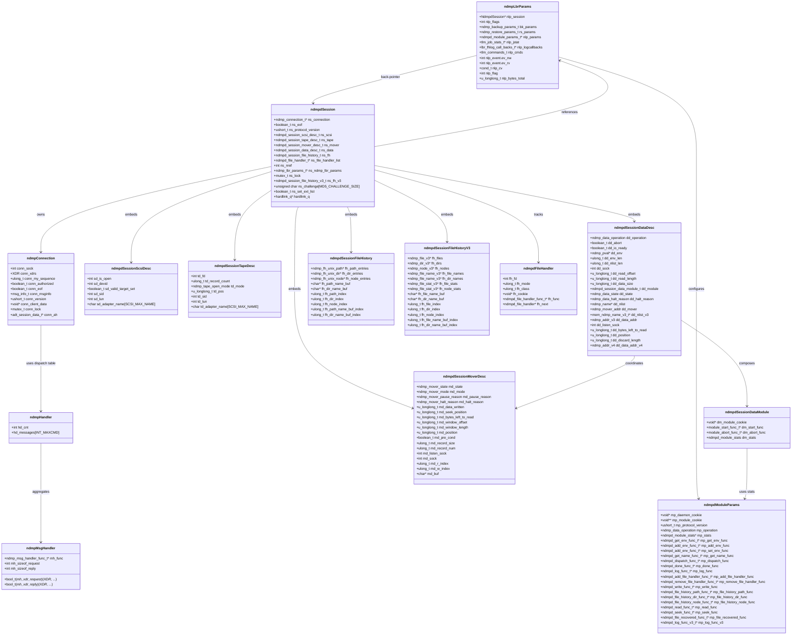
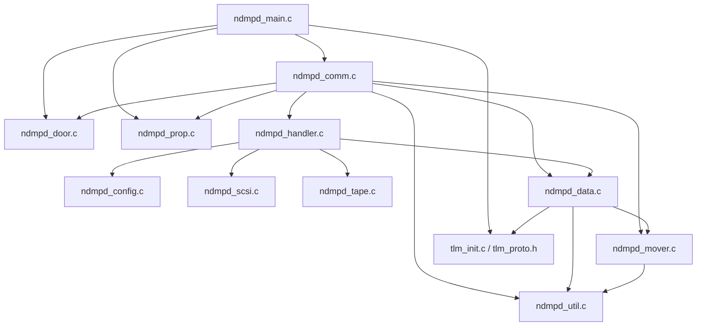

# NDMP 控制面结构概览

本节根据 `ndmpd` 守护进程的源码，总结核心控制面的结构体关系与模块依赖。下方 Mermaid 图可直接在支持 Mermaid 的渲染器中查看。

## 核心结构体类图

上述类图归纳了 `ndmpd` 控制面使用的关键结构体与嵌套关系。

## 控制面模块依赖图

- `ndmpd_main.c` 负责加载插件、初始化 door 服务、ZFS 与 TLM 子系统，并启动 `ndmpd_main` 工作线程，过程中直接依赖属性管理与 door 控制接口。【F:trunk/usr/src/cmd/ndmpd/ndmp/ndmpd_main.c†L75-L117】【F:trunk/usr/src/cmd/ndmpd/ndmp/ndmpd_main.c†L205-L305】【F:trunk/usr/src/cmd/ndmpd/tlm/tlm_init.c†L492-L540】【F:trunk/usr/src/cmd/ndmpd/ndmp/ndmpd_door.c†L64-L147】
- `ndmpd_comm.c` 中的 `ndmpd_main` 打开日志、解析端口并调用 `ndmp_run`，而连接处理器在会话初始化时依次调用数据、文件历史、mover 以及 LBR 初始化逻辑，维护与 door、属性及选择循环的交互。【F:trunk/usr/src/cmd/ndmpd/ndmp/ndmpd_comm.c†L787-L815】【F:trunk/usr/src/cmd/ndmpd/ndmp/ndmpd_comm.c†L831-L919】
- `ndmpd_handler.c` 的消息分发表将 NDMP 消息分派到配置、SCSI、磁带、数据等子模块的处理函数，体现了控制面命令处理的依赖关系。【F:trunk/usr/src/cmd/ndmpd/ndmp/ndmpd_handler.c†L117-L560】
- 数据面辅助逻辑位于 `ndmpd_data.c`、`ndmpd_mover.c` 与 `ndmpd_util.c`，前者既操作 mover，又调用 TLM 统计与环境管理接口，对备份模块结构 `ndmp_lbr_params_t` 与 TLM 统计数据进行读写。【F:trunk/usr/src/cmd/ndmpd/ndmp/ndmpd_data.c†L1618-L1767】【F:trunk/usr/src/cmd/ndmpd/ndmp/ndmpd_data.c†L1783-L1836】【F:trunk/usr/src/cmd/ndmpd/ndmp/ndmpd_mover.c†L1854-L1883】【F:trunk/usr/src/cmd/ndmpd/ndmp/ndmpd_util.c†L1045-L1074】【F:trunk/usr/src/cmd/ndmpd/tlm/tlm_proto.h†L62-L153】
- LBR 参数与备份模块通过 `ndmp_lbr_init` 构造，与会话形成双向引用；模块参数结构记录了回调接口，支撑数据/备份流程。【F:trunk/usr/src/cmd/ndmpd/ndmp/ndmpd.h†L231-L459】【F:trunk/usr/src/cmd/ndmpd/ndmp/ndmpd_common.h†L205-L240】【F:trunk/usr/src/cmd/ndmpd/ndmp/ndmpd_util.c†L1045-L1074】

以上图示与说明帮助理解 NDMP 控制面的主要结构体组织与源码模块之间的调用依赖。
